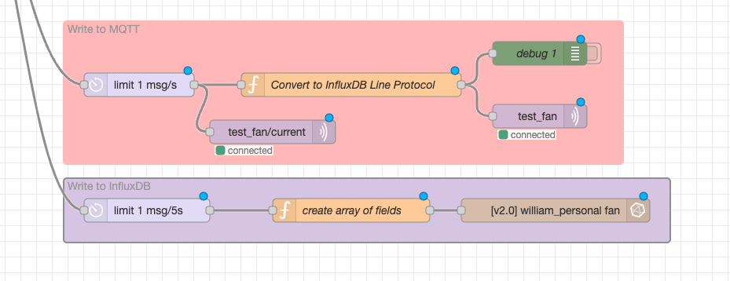

## Node Red Integrations
Node-Red is used to query the current clamp and then write the data to the cloud (In this case MQTT and InfluxDB)

A high-level example of the MQTT and InfluxDB portion is shown below:

## MQTT
- Here, I used the native MQTT connector to publish messages to my MQTT broker (In this case, HiveMQ)
- I experimented with sending data in line protocol via MQTT but later opted to send data directly to InfluxDB via the Node-Red Module

## InfluxDB
- For InfluxDB integrations, you can integrate via Telegraf and stream the MQTT messages in via Telegraf and parse to InfluxDB (This does not require anything on the Node Red side)
- You can also write data from Node-Red to InfluxDB via the REST API or via the InfluxDB Node-Red Modules. linked below:
https://flows.nodered.org/node/node-red-contrib-influxdb

